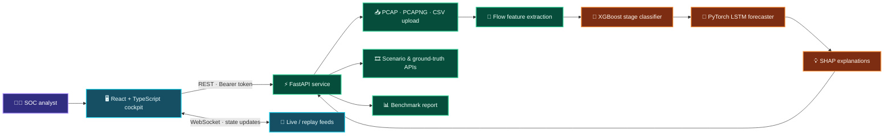
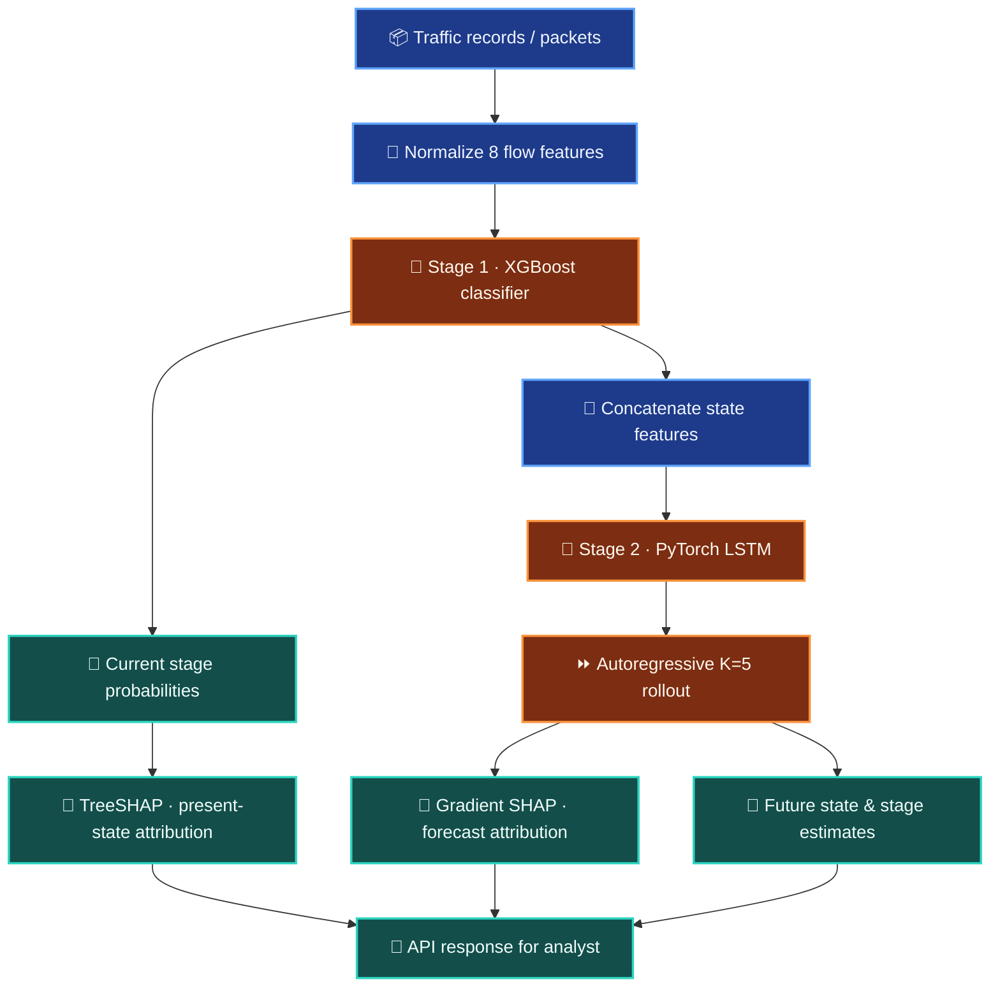
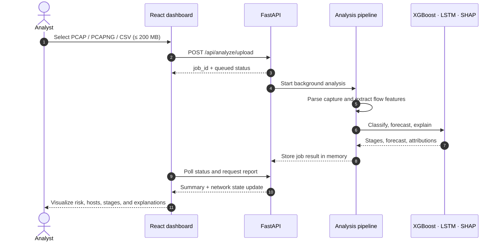
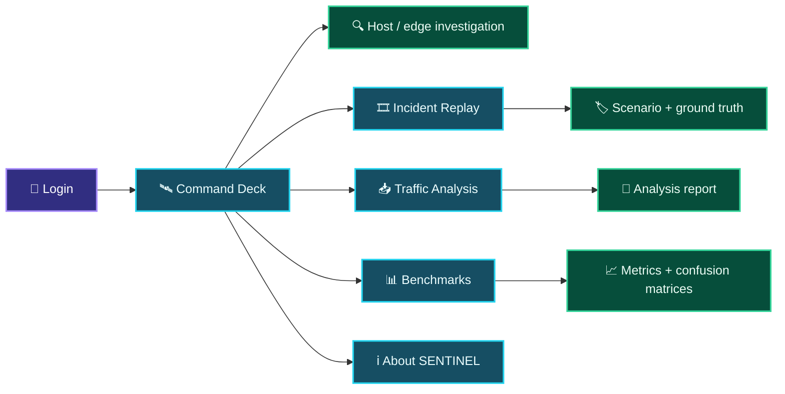

<div align="center">

# 🛰️ SENTINEL
### Predict the next move. Give defenders time to respond.

**A predictive network-defense cockpit for exploring traffic, visualizing attack progression, and forecasting what may happen next.**

<p>
  
  
  
  
  
</p>

[Explore the architecture](sih-backend/docs/architecture.md) · [Frontend](sih-project/) · [Backend](sih-backend/)

</div>

---


> [!IMPORTANT]
> **SENTINEL is a research prototype and decision-support interface—not a production IDS, firewall, or automated containment system.** The live dashboard currently uses a generated sample stream. Uploaded PCAP/PCAPNG/CSV files are analyzed locally by the backend, but prototype device actions do not modify a real host or network. See [Prototype boundaries](#-prototype-boundaries--security-notes).

## ✨ What is SENTINEL?

Most security tooling tells a team what has already happened. SENTINEL explores a more forward-looking question: **what network state could come next?** It combines flow-level classification, sequence forecasting, and feature attribution in a visual analyst workspace.

The application brings together a React command deck and a Python analysis API. Analysts can inspect a network graph, follow attack-stage signals, upload traffic captures, replay scenarios, and review model-versus-baseline metrics.

### At a glance

| 🧭 Observe | 🔮 Forecast | 🧪 Investigate | 📊 Evaluate |
|:--|:--|:--|:--|
| Explore hosts, connections, risk, and event summaries in the command deck. | Inspect multi-step network-state forecasts and attack-stage probabilities. | Analyze a PCAP, PCAPNG, or CSV capture, or scrub through a scenario replay. | Review benchmark summaries, per-stage metrics, and confusion matrices. |

## 🧩 Capability map

| Area | What you can explore |
|:--|:--|
| **Command Deck** | Interactive network twin, host/edge details, risk indicators, event feed, kill-chain rail, and timeline controls. |
| **Traffic Analysis** | Upload `.pcap`, `.pcapng`, or `.csv` traffic (up to 200 MB) for feature extraction, classification, forecasting, and an explainable report. |
| **Incident Replay** | Select a labeled scenario, control playback, and inspect attack-stage annotations and probability overlays. |
| **Benchmarks** | Review model report-card metrics and comparisons with a logistic-regression baseline. |
| **Explainability** | Surface feature contributions for observed state and forecast outputs. |
| **API** | FastAPI REST endpoints and authenticated WebSocket feeds for dashboard state and replay. |

## 🗺️ System architecture



### 🧠 Two-stage prediction pipeline

The backend builds an eight-feature flow representation, classifies the current attack stage, then rolls the sequence model forward. The documented rollout uses **five forecast steps**; the nominal windowing described in the architecture is 15 seconds per step (up to 75 seconds).



### 📥 Capture-analysis journey



### 🖥️ Analyst workspace



## 🔌 API surface

The backend runs at `http://localhost:8000` by default. Protected routes expect the prototype bearer token; WebSockets receive it as a query parameter.

| Method | Path | Purpose |
|:--|:--|:--|
| `POST` | `/api/auth/login` | Prototype login and token response. |
| `POST` | `/api/analyze/upload` | Queue a supported traffic file for analysis. |
| `GET` | `/api/analyze/{job_id}/status` | Read the in-memory analysis job status. |
| `GET` | `/api/analyze/{job_id}/report` | Fetch a completed analysis report. |
| `GET` | `/api/scenarios` | List available replay scenarios. |
| `GET` | `/api/scenarios/{id}/ground_truth` | Read scenario attack-stage annotations. |
| `GET` | `/api/benchmarks` | Fetch the benchmark report. |
| `WS` | `/ws` | Authenticated live dashboard state feed. |
| `WS` | `/ws/replay?scenario_id=...` | Authenticated scenario replay stream. |
| `GET` | `/api/devices/{device_id}` | Read prototype device state; **not a real endpoint security control**. |

Interactive API documentation is available at [`http://localhost:8000/docs`](http://localhost:8000/docs) after starting the backend.

## 🚀 Run it locally

### Prerequisites

- **Python 3.11+**
- **Node.js 22.12+** and npm
- Git LFS for the large tracked dataset files

### 1. Start the backend

From the repository root, in a terminal:

```powershell
cd sih-backend
python -m venv .venv
.\.venv\Scripts\Activate.ps1
python -m pip install --upgrade pip
python -m pip install -r requirements.txt
python -m src.api.main
```

The API starts at `http://localhost:8000`.

### 2. Start the frontend

In a second terminal, from the repository root:

```powershell
cd sih-project
npm ci
npm run dev
```

Open the local Vite URL printed in the terminal (normally `http://localhost:5173`).

### 3. Sign in (prototype only)

The local prototype credentials are prefilled in the login screen:

```text
Email:    admin@sentinel.ai
Password: sentinel123
```

> [!WARNING]
> These are hard-coded demo credentials, not production authentication. Never deploy the prototype with these credentials or its current token implementation exposed to an untrusted network.

### Optional: configure API origins

The frontend defaults to port `8000` on the browser's current hostname. If the API is hosted elsewhere, create `sih-project/.env.local`:

```dotenv
VITE_API_BASE_URL=http://localhost:8000
VITE_WS_BASE_URL=ws://localhost:8000
```

### Useful frontend commands

```powershell
cd sih-project
npm run build
npm run lint
npm run preview
```

## 🧪 Data, modes, and interpretation

SENTINEL currently has distinct paths that should not be conflated:

| Path | Current behavior |
|:--|:--|
| **Command Deck live feed** | The backend WebSocket currently produces periodic state updates from a generated sample dataset. This is a prototype simulation—not a passive tap into your network. |
| **Traffic Analysis** | Uploaded `.pcap`, `.pcapng`, and `.csv` files are parsed and analyzed by the backend pipeline. Uploads are capped at 200 MB and the temporary job directory is removed when processing finishes. |
| **Incident Replay** | Scenario metadata and ground-truth annotations are exposed by the API. The replay stream is a prototype visualization; validate against source captures before treating a chart as empirical ground truth. |
| **Benchmarks** | The API serves the latest persisted report when available, otherwise it runs the configured held-out evaluator. Read the report metadata and evaluation split before comparing scores. |

The project documents these eight normalized flow features: `syn_ack_ratio`, `port_entropy`, `iat_variance`, `payload_entropy`, `dns_query_length`, `flow_duration_ms`, `bytes_sent`, and `bytes_recv`. CSV analysis may derive or approximate missing features; the report calls out missing inputs where applicable.

## 🛡️ Prototype boundaries & security notes

- This is **not** a substitute for a production IDS, SIEM, EDR, firewall, or incident-response process.
- The live WebSocket stream is generated from sample data. Real capture analysis is available through the explicit upload workflow; there is no claim of continuous production packet monitoring.
- Prototype login uses a fixed token and demo credentials. Replace authentication, secret handling, authorization, and CORS policy before deployment.
- Analysis job state and prototype device state are held in memory; they are not durable audit records.
- Device-action endpoints do **not** enforce a firewall rule or disconnect a real machine. The direct disconnect action is disabled; approval/automatic actions are prototype state changes only.
- Treat predictions as analyst decision support. Validate model inputs, metrics, and thresholds against your own environment before operational use.

## 🌱 Roadmap

### Future scope: firewall-assisted host isolation

A future integration could turn approved containment decisions into narrowly scoped, auditable firewall actions. **That integration is not implemented today.** The prototype device-state endpoints are not firewall controls.

```mermaid
flowchart LR
    Signal["📡 SENTINEL risk signal"] --> Policy["🧮 Policy + confidence checks"]
    Policy -->|Below threshold / uncertain| Review["👤 Analyst review"]
    Policy -->|Eligible, allow-listed action| Approval["✅ Explicit approval + MFA"]
    Review -->|Approve| Approval
    Review -->|Deny| Monitor["👁️ Continue monitoring"]
    Approval --> Preview["🧾 Preview exact rule + scope"]
    Preview --> Firewall["🧱 Future firewall integration"]
    Firewall --> Audit["📚 Durable audit event"]
    Firewall --> Restore["↩️ Verified rollback / restore"]
    Approval -. "not implemented" .-> Firewall

    classDef signal fill:#312e81,stroke:#a78bfa,color:#fff,stroke-width:2px;
    classDef guard fill:#7c2d12,stroke:#fb923c,color:#fff7ed,stroke-width:2px;
    classDef human fill:#164e63,stroke:#22d3ee,color:#ecfeff,stroke-width:2px;
    classDef future fill:#3f3f46,stroke:#a1a1aa,color:#fafafa,stroke-dasharray:5 5,stroke-width:2px;
    class Signal signal;
    class Policy,Preview guard;
    class Review,Approval,Monitor human;
    class Firewall,Audit,Restore future;
```



Potential milestones:

1. **Firewall adapters** — integrate with supported vendors through least-privilege APIs and a dry-run mode.
2. **Safe decision gates** — configurable risk thresholds, allow-lists, confidence requirements, and human approval for disruptive actions.
3. **Containment lifecycle** — show the exact proposed scope, apply only approved rules, verify outcome, and provide a tested rollback/restore path.
4. **Audit & access control** — durable action history, role-based permissions, MFA, idempotency, and operator attribution.
5. **Validation** — exercise in an isolated lab with false-positive review, failure handling, and recovery drills before any production deployment.

Other potential directions include secure production authentication, durable job and approval storage, real monitored-network ingestion, and broader scenario-level validation.

## 🧰 Technology stack

| Layer | Technologies |
|:--|:--|
| Web client | React 19, TypeScript, Vite, React Router, Zustand, Tailwind CSS |
| Visualization | Plotly, force-directed network graph, Lucide icons |
| API & streaming | Python, FastAPI, Pydantic, Uvicorn, WebSockets |
| Analysis | Pandas, NumPy, Scapy, scikit-learn, XGBoost, PyTorch, SHAP |
| Persistence | SQLite with SQLAlchemy (prototype persistence layer) |
| Dataset files | CIC-IDS capture CSVs tracked with Git LFS |

## 📂 Repository layout

```text
.
├── README.md                  # Project overview, diagrams, setup, and roadmap
├── sih-project/               # React + TypeScript analyst interface
│   ├── src/pages/              # Command deck, replay, analysis, benchmarks, etc.
│   └── data/                   # CIC-IDS capture CSVs (Git LFS)
└── sih-backend/                # FastAPI API and analysis engine
    ├── src/api/                # REST routes and WebSocket handlers
    ├── src/features/           # Traffic feature extraction
    ├── src/ingestion/          # PCAP/CSV parsing and analysis jobs
    ├── src/models/             # Classifier, world model, and explainability
    └── docs/architecture.md    # Model and architecture specification
```

## 📚 Further reading

- [Backend setup and API notes](sih-backend/README.md)
- [System architecture and model formulation](sih-backend/docs/architecture.md)
- [Frontend package scripts](sih-project/package.json)

---

<div align="center">

**SENTINEL · SIH26153**<br>
*Observe the signal. Forecast the shift. Keep the human in control.*

</div>
