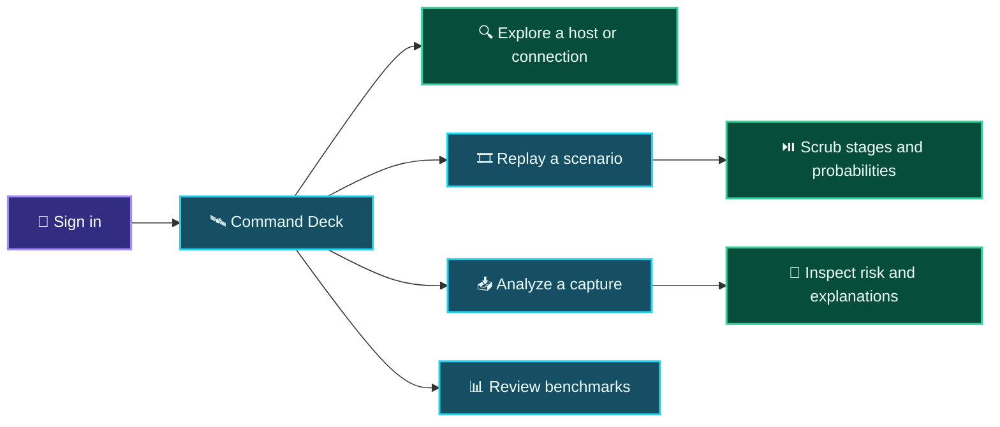

<div align="center">

# 🛰️ SENTINEL · Analyst Cockpit
### See the network. Trace the signal. Explore what comes next.

**The React frontend for SENTINEL’s predictive network-defense research prototype.**

<p>
  
  
  
  
</p>

[← Project overview](../README.md) · [Backend guide](../sih-backend/README.md) · [Architecture](../sih-backend/docs/architecture.md)

</div>

---

> [!IMPORTANT]
> This is a **research prototype**, not a production security console. The live dashboard can display generated sample data, and prototype actions do not isolate a real host or apply firewall rules. See the [root README’s prototype and security notes](../README.md#-prototype-boundaries--security-notes).

## 🌌 What’s inside

SENTINEL’s frontend is an interactive analyst workspace for viewing network state, exploring forecast signals, inspecting traffic-analysis reports, and replaying labeled scenarios.

| Workspace | Route | What it does |
|:--|:--|:--|
| **Command Deck** | `/` | Displays the network twin, risk overview, event feed, kill-chain rail, and timeline. |
| **Host investigation** | `/investigate/:nodeId` | Opens the Command Deck with `nodeId` selected in the network graph and host detail panel. |
| **Incident Replay** | `/replay` | Plays a selected scenario with speed controls and model/baseline probability overlays. |
| **Traffic Analysis** | `/analyze` | Uploads PCAP, PCAPNG, or CSV traffic for backend analysis and presents the report. |
| **Benchmarks** | `/benchmarks` | Shows model metrics, comparisons, and confusion matrices. |
| **About** | `/about` | Introduces the SENTINEL system. |
| **Login** | `/login` | Prototype sign-in screen. Other application routes require its local session state. |

### 🧭 Analyst journey



## 🚀 Run locally

### Prerequisites

- **Node.js 22.12+** and npm
- The SENTINEL backend for login, API-powered analysis, scenarios, benchmarks, and WebSocket streams. The backend setup is in the [root project guide](../README.md#-run-it-locally).

From this directory (`sih-project/`):

```powershell
npm ci
npm run dev
```

Open the URL Vite prints in the terminal (typically `http://localhost:5173`).

### Prototype sign-in

The login page pre-fills the local evaluator account:

```text
Email:    admin@sentinel.ai
Password: sentinel123
```

> [!WARNING]
> These credentials and the backend token are hard-coded prototype values. They are not appropriate for deployment or production authentication.

## 🔧 Connect to the API

By default, the frontend builds its HTTP and WebSocket API origins from the browser’s current hostname on port `8000`. To point it at a different backend, create `.env.local` in `sih-project/`:

```dotenv
VITE_API_BASE_URL=http://localhost:8000
VITE_WS_BASE_URL=ws://localhost:8000
```

Use an HTTPS API origin and `wss://` WebSocket origin when deploying behind TLS. These variables are read in [`src/config/endpoints.ts`](src/config/endpoints.ts). Vite exposes `VITE_*` variables to browser code, so **never put secrets in them**.

If the backend is not reachable, the live WebSocket client retries a limited number of times and then falls back to the standalone mock engine. This is useful for interface exploration, but its generated data should not be interpreted as live network telemetry.

## 🧰 Frontend scripts

| Command | Description |
|:--|:--|
| `npm run dev` | Start Vite’s local development server. |
| `npm run build` | Run TypeScript project checks and create a production build in `dist/`. |
| `npm run lint` | Run Oxlint. |
| `npm run preview` | Preview the built frontend locally. |

## 🧱 Frontend structure

```text
src/
├── App.tsx                 # Lazy-loaded pages and protected routes
├── main.tsx                # React entry point
├── components/             # Network graph, charts, rails, panels, and controls
├── config/endpoints.ts     # HTTP and WebSocket origins
├── pages/                  # CommandDeck, IncidentReplay, Analyze, Benchmarks, About, Login
├── services/               # WebSocket clients, normalization, and mock engine
├── store/                  # Zustand application state
├── types/                  # Shared domain types
├── App.css                 # App-level styles
└── index.css               # Global styles and Tailwind directives
```

The app is built with **React 19**, **TypeScript**, **Vite**, **React Router**, **Zustand**, **Tailwind CSS 3**, **Plotly**, **react-force-graph-2d**, **Framer Motion**, and **Lucide**.

## 🧪 Before you ship

```powershell
npm run lint
npm run build
```

Also validate against the backend: sign in, open the Command Deck, confirm WebSocket status, load scenarios, submit a small supported capture, and inspect benchmark loading. These checks exercise API behavior that a standalone frontend build cannot validate.

## 🔐 Safety note

The frontend visualizes data and calls the prototype API; it is not a firewall or endpoint isolation agent. Firewall-assisted host disconnection is **future scope** and is not currently implemented as a real network control. Predictions should be treated as analyst decision support, not automated response instructions.
